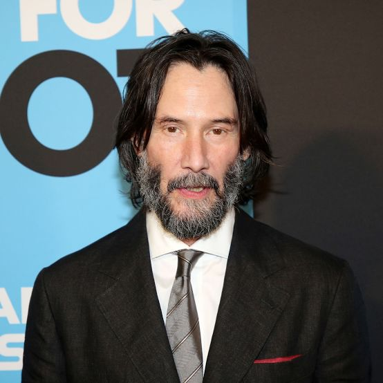

## Keanu Reeves

Keanu Charles Reeves – kanadyjski aktor, reżyser, producent filmowy, muzyk i filantrop. Występował w seriach rozpoczętych przez filmy Matrix oraz John Wick. Należy do najlepiej opłacanych aktorów. 31 stycznia 2005 otrzymał gwiazdę w Alei Gwiazd w Los Angeles znajdującą się przy 6801 Hollywood Boulevard. Wikipedia
Data i miejsce urodzenia: 2 września 1964 61 lat, Bejrut, Liban
Wzrost: 1,86 m
Wykształcenie: De La Salle College "Oaklands" · Pokaż więcej
Rodzice: Patricia Taylor, Samuel Nowlin Reeves, Jr
Rodzeństwo: Kim Reeves, Emma Reeves, Karina Miller
Imię i nazwisko: Keanu Charles Reeves

🧒 Early Life
* 1964 (Sept 2) — Born in Beirut, Lebanon, to Patricia Taylor (a costume designer) and Samuel Nowlin Reeves Jr. (a geologist).
* 1966–1970s — Family moved frequently — lived in Sydney, Australia; then New York City; and eventually settled in Toronto, Canada.
* 1971 — Parents divorced; raised primarily by his mother.
* Late 1970s–Early 1980s — Attended several high schools, including Etobicoke School of the Arts, but was expelled; later attended De La Salle College.
* 1983 — Dropped out of high school to pursue acting full time.
🎬 Career Beginnings
* 1984 — First major TV role in Hangin’ In (Canadian TV series).
* 1985 — Appeared in stage productions and small TV films such as Letting Go.
* 1986 — Film debut in Youngblood, playing a hockey goalie.
* 1986–1988 — Gained attention with roles in River’s Edge and Dangerous Liaisons.
🌟 Rise to Fame
* 1989 — Breakout role as Ted Logan in Bill & Ted’s Excellent Adventure.
* 1991 — Starred in Point Break (with Patrick Swayze) — solidified as an action star.
* 1991 — Reprised role in Bill & Ted’s Bogus Journey.
* 1992 — Played Jonathan Harker in Bram Stoker’s Dracula.
* 1994 — Global success with Speed alongside Sandra Bullock.
💔 Personal Struggles
* 1999 — Girlfriend Jennifer Syme gave birth to a stillborn daughter, Ava Archer Syme-Reeves.
* 2001 — Jennifer Syme died in a car accident — a major emotional blow to Reeves.
🔥 Career Renaissance
* 1999 — Starred in The Matrix, a groundbreaking sci-fi film that became a cultural phenomenon.
* 2003 — Reprised role in The Matrix Reloaded and The Matrix Revolutions.
* 2005 — Starred in Constantine.
* 2006 — Reunited with Sandra Bullock in The Lake House.
* 2008 — Played the alien Klaatu in The Day the Earth Stood Still.
💥 The John Wick Era
* 2014 — Revitalized his career with John Wick — major critical and commercial success.
* 2017 — John Wick: Chapter 2 released.
* 2019 — John Wick: Chapter 3 – Parabellum released; also voiced Duke Caboom in Toy Story 4 and appeared in Always Be My Maybe.
* 2021 — The Matrix Resurrections released.
* 2023 — John Wick: Chapter 4 released to major acclaim.
🎸 Other Endeavors & Public Image
* 1990s–2000s — Played bass guitar in the band Dogstar.
* 2020s — Dogstar reunited for new tours and music releases.
* Known for his kindness, humility, and philanthropy — quietly donates to children’s hospitals and cancer research.
* 2020–Present — In a relationship with artist Alexandra Grant.
🕊️ Present
* 2025 — Continues acting, producing, and performing music with Dogstar; remains one of Hollywood’s most beloved and respected figures.
  
[Wipedia](https://www.google.com/url?sa=t&source=web&rct=j&opi=89978449&url=https://pl.wikipedia.org/wiki/Keanu_Reeves&ved=2ahUKEwjUydDb-7KQAxVp7bsIHfk4CkUQmhN6BAgjEAI&usg=AOvVaw0RkcotzDkGolKSgWjavMLB)

[Filmweb](https://www.filmweb.pl/person/Keanu+Reeves-87)